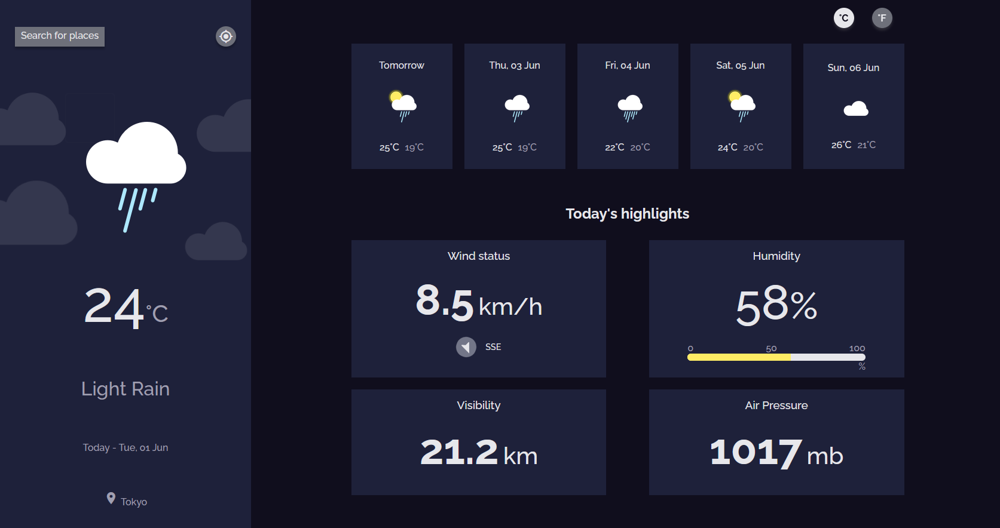

<!-- Please update value in the {}  -->

<h1 align="center">Weather App</h1>

<div align="center">
   Solution for a challenge from  <a href="http://devchallenges.io" target="_blank">Devchallenges.io</a>.
</div>

<div align="center">
  <h3>
    <a href="https://camain-elie.github.io/weather-app/">
      Demo
    </a>
    <span> | </span>
    <a href="https://github.com/camain-elie/weather-app">
      Solution
    </a>
    <span> | </span>
    <a href="https://devchallenges.io/challenges/mM1UIenRhK808W8qmLWv">
      Challenge
    </a>
  </h3>
</div>

<!-- TABLE OF CONTENTS -->

## Table of Contents

- [Overview](#overview)
  - [Built With](#built-with)
- [Features](#features)
- [How to use](#how-to-use)
- [Contact](#contact)
- [Acknowledgements](#acknowledgements)

<!-- OVERVIEW -->

## Overview



My solution for devchallenge.io's Weather App challenge. I did it as a training project to get more confortable using React. This project was a bit more challenging than the previous one but was still pretty simple overall. I got better in css and got more comfortable fetching data with an API, using async/await functions and the organisation inside a React project.

I tried to make a fully responsive integration, although, the forecasts section could be improved a bit !

I could also improve a little the organisation of the component folder and make the "humidity highlight" a true "highlight component, like I did with the wind highlight.
Tests might also be added later. The rotation of the wind is neither pretty nor optimal.

### Built With

<!-- This section should list any major frameworks that you built your project using. Here are a few examples.-->

- [React](https://reactjs.org/)
- [Create-React-App](https://create-react-app.dev/)
- [Sass](https://sass-lang.com/)

## Features

<!-- List the features of your application or follow the template. Don't share the figma file here :) -->

This application/site was created as a submission to a [DevChallenges](https://devchallenges.io/challenges) challenge. The [challenge](https://devchallenges.io/challenges/mM1UIenRhK808W8qmLWv) was to build an application to complete the given user stories.

I completed all the user stories, even the optinal ones. I also added conversion of all unit from the metric to the imperial system while only the C° to F° was optionaly required. 

## How To Use

<!-- Example: -->

To clone and run this application, you'll need [Git](https://git-scm.com) and [Node.js](https://nodejs.org/en/download/) (which comes with [npm](http://npmjs.com)) installed on your computer. From your command line:

```bash
# Clone this repository
$ git clone https://github.com/camain-elie/weather-app.git

# Install dependencies
$ npm install

# Run the app
$ npm start
```

## Acknowledgements

<!-- This section should list any articles or add-ons/plugins that helps you to complete the project. This is optional but it will help you in the future. For example: -->

- [Steps to replicate a design with only HTML and CSS](https://devchallenges-blogs.web.app/how-to-replicate-design/)
- [Node.js](https://nodejs.org/)
- [Stackoverflow - a few answers helped me a lot as usual](https://stackoverflow.com/)
- [React.js](https://fr.reactjs.org/)
- [metaweather.com - a weather API](https://www.metaweather.com/api/)

## Contact

- GitHub [@camain-elie](https://github.com/camain-elie)
